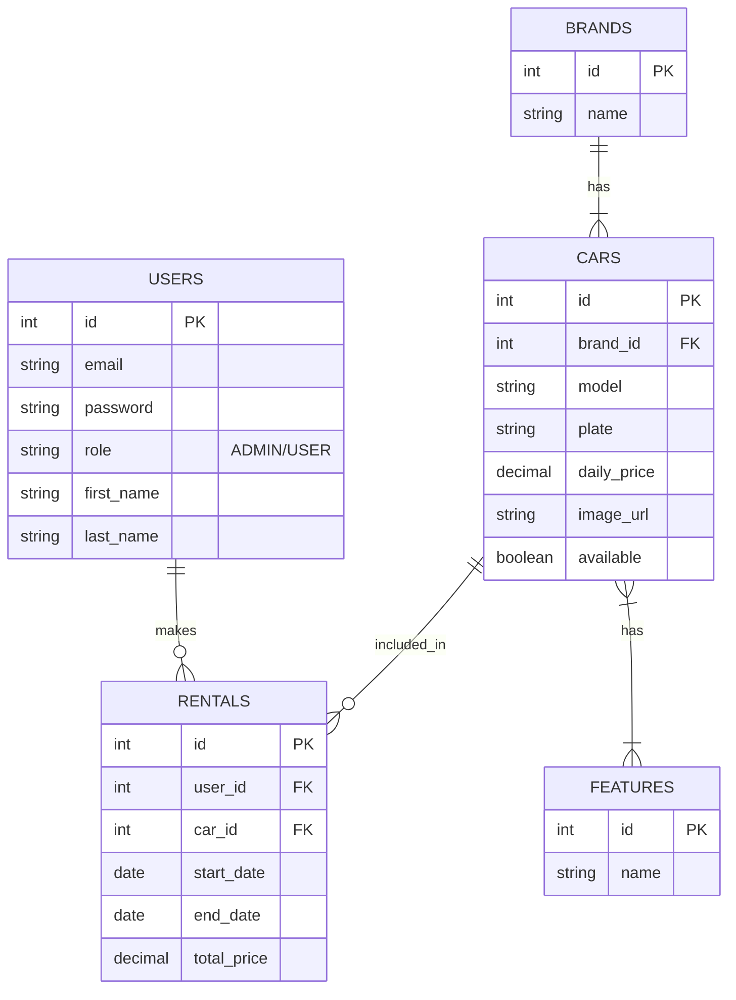

# Rent a Car - Proje Raporu

**Öğrenci Adı:** [Adınız Soyadınız]  
**Tarih:** 09.01.2026

## 1. Proje Özeti
Bu proje, araç kiralama süreçlerini dijitalleştirmek amacıyla geliştirilmiş modern bir web uygulamasıdır. Kullanıcılar üye olup araç kiralayabilirken, yöneticiler (Admin) araçları, markaları ve özellikleri yönetebilirler.

## 2. Kullanılan Teknolojiler
- **Frontend:** React, TypeScript, Vite
- **UI Kütüphaneleri:** Tailwind CSS, Flowbite React
- **Router:** React Router DOM (v6)
- **HTTP Client:** Axios
- **State Management:** React Context API (Auth)

---

## 3. Backend Endpoint Dokümantasyonu

Uygulamanın backend ile iletişim kurduğu temel API noktaları aşağıdadır:

### Kimlik Doğrulama (Auth)
- `POST /api/auth/login`: Kullanıcı girişi yapar. (Dönen: JWT Token + Kullanıcı Bilgisi)
- `POST /api/auth/register`: Yeni kullanıcı kaydı oluşturur.

### Markalar (Brands)
- `GET /api/brands`: Tüm markaları listeler.
- `GET /api/brands/{id}`: Belirli bir markayı getirir.
- `POST /api/brands`: Yeni marka ekler (Admin).
- `PUT /api/brands/{id}`: Marka günceller (Admin).
- `DELETE /api/brands/{id}`: Marka siler (Admin).

### Özellikler (Features)
- `GET /api/features`: Tüm araç özelliklerini listeler.
- `POST /api/features`: Yeni özellik tanımlar (Admin).
- `PUT /api/features/{id}`: Özellik günceller (Admin).
- `DELETE /api/features/{id}`: Özellik siler (Admin).

### Arabalar (Cars)
- `GET /api/cars`: Tüm araçları listeler.
- `POST /api/cars`: Yeni araç ekler. (Body: `brandId`, `model`, `price`, `featureIds[]`...)
- `PUT /api/cars/{id}`: Araç bilgilerini günceller.
- `DELETE /api/cars/{id}`: Aracı siler.

---

## 4. Frontend Bileşenleri

Proje, yeniden kullanılabilir ve modüler React bileşenleri üzerine inşa edilmiştir:

- **Navbar (AppNavbar):** Kullanıcının rolüne göre (Admin/User/Misafir) menü seçeneklerini dinamik olarak gösterir.
- **ProtectedRoute:** Yalnızca yetkili kullanıcıların (örn. Admin) belirli sayfalara erişmesini sağlayan güvenlik katmanıdır.
- **AuthContext:** Kullanıcı oturum bilgilerini ve JWT token'ı tüm uygulama genelinde yönetir.
- **Generic List & Forms:** `BrandList`, `FeatureList`, `CarList` bileşenleri, tablo listeleme ve Modal içinde form işlemlerini (Ekle/Düzenle) tek sayfada birleştirir.

---

## 5. Veritabanı Şeması (ER Diyagramı)

Aşağıdaki diyagram veritabanı tabloları arasındaki ilişkileri göstermektedir:

---

## 6. Proje Bağlantısı
Canlı Proje Linki: [Buraya Deploy Linki Gelecek]
GitHub Deposu: [Buraya GitHub Linki Gelecek]

